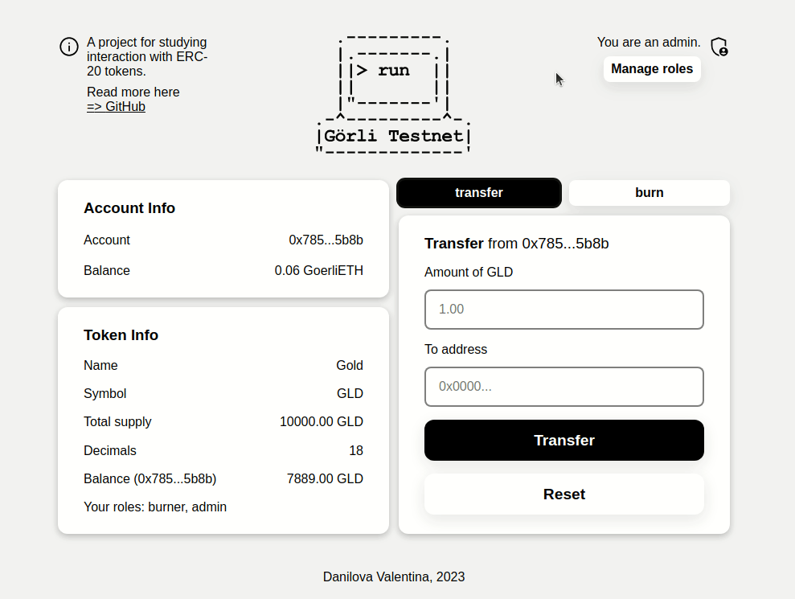
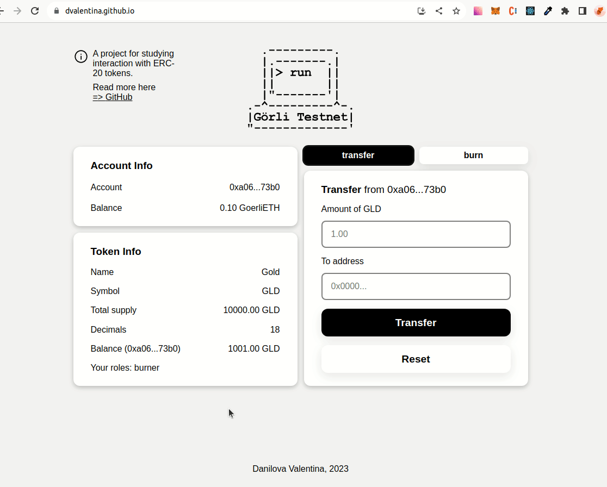
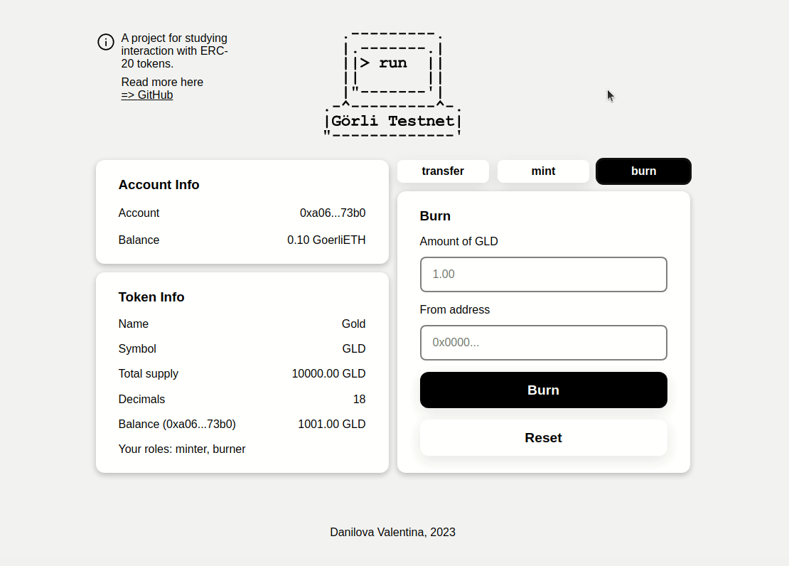
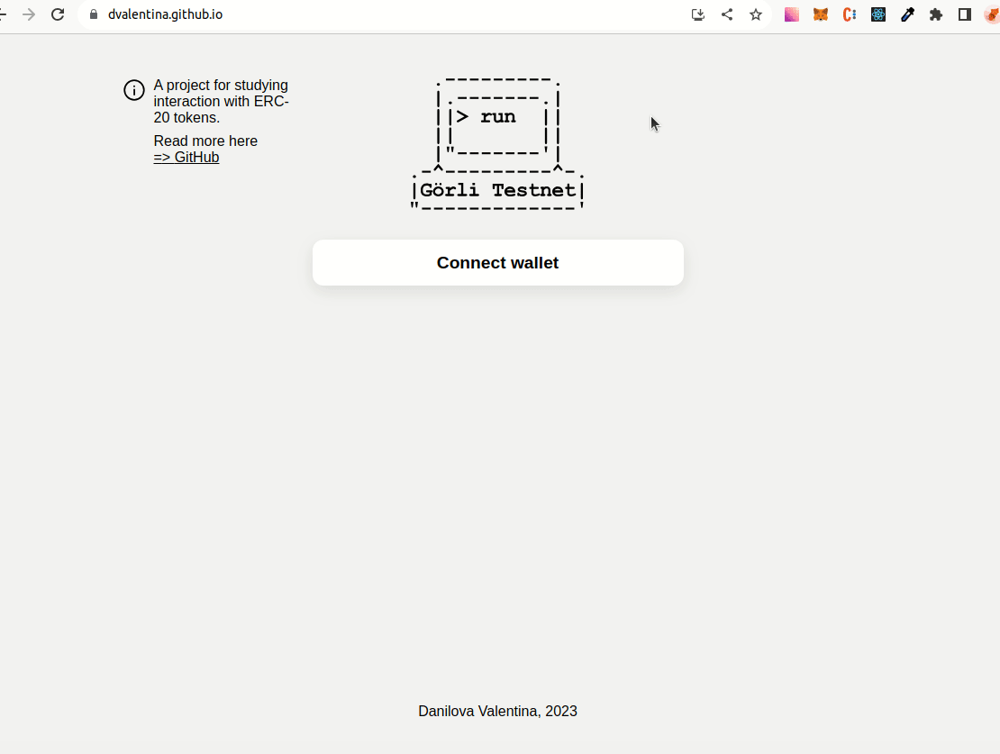

# Gold Token
This is a project developed to study ERC-20 tokens and the integration of front-end part of the application with web3 wallets and contracts.

Here is a demo of the application's interface:

## Frontend
### Deploy
This project is **deployed** to GitHub Pages and available here:

[https://dvalentina.github.io/gold-token/](https://dvalentina.github.io/gold-token/)
### Features
- Connecting to a web3 wallet
- Displaying information about the connected account and the ERC-20 token
- Transfering, minting, and burning tokens *(forms availability depends on the account's roles)*
- Admin page
- Granting and revoking roles *(from admin page)*
- Notification system
- Responsive layout
- Reusable components

### Demo
#### Connecting a Metamask wallet

#### Transfering tokens between accounts
> View this demo's transaction on [=> Etherscan](https://goerli.etherscan.io/tx/0xdd74aa4dc8e401e4d742a6ef960735cff1288106d14043471fa50c64f464af08)

#### Granting the minter role

> Granting took some time in this demo, please wait a bit! :&#8203;-&#8203;)\
> View this demo's transaction on [=> Etherscan](https://goerli.etherscan.io/tx/0x1443fd9f94b405eaebc1d0aa115c943677d9cae38a74f0bd2e4444a4b9e36e76)

#### Rejecting transaction

#### Responsive layout

#### Switching wrong network

## ERC-20 Token
### Deploy
The GLDToken contract made for this project is **deployed** and **verified** at Goerli Testnet:

[https://goerli.etherscan.io/address/0xF61E8fA20930EFcEa54D83CE9E5E5C7F2A66b1ee](https://goerli.etherscan.io/address/0xF61E8fA20930EFcEa54D83CE9E5E5C7F2A66b1ee)
### Features
- ERC-20 token contract using openzeppelin implementation
- **Minting/burning tokens** functionality
- **Granting/revoking roles** functionality

## Tools & Technologies

- React, create-react-app
- React context, custom hooks
- styled-components
- CSS grid
- hardhat
- ethers
- Goerli Testnet
- openzeppelin

## Sources

### Logo I used

[Görli Testnet Logo](https://github.com/goerli/goer-logo)

### Tutorials I followed

- [Hardhat's tutorial for beginners](https://hardhat.org/tutorial)
- [Hardhat Runner Docs](https://hardhat.org/hardhat-runner/docs/getting-started#overview)
- [DEV A Concise Hardhat Tutorial: Part 2 - ERC20 Token](https://dev.to/yakult/a-concise-hardhat-tutorial-part-2-writing-erc20-2jpm)
- [ChainShot Hardhat Guides Setup](https://www.chainshot.com/article/hardhat-guides-setup)
- [ChainShot Hardhat Guide: How to Deploy Your Own ERC-20 Token ](https://www.chainshot.com/article/deploy-your-own-token)
- [How to Connect Your Dapp With MetaMask Using Ethers.js](https://www.quicknode.com/guides/web3-sdks/how-to-connect-your-dapp-with-metamask-using-ethersjs)
- [MetaMask Docs](https://docs.metamask.io/guide/ethereum-provider.html#using-the-provider)
- [Notification system](https://dev.to/kevjose/building-a-reusable-notification-system-with-react-hooks-and-context-api-2phj)
